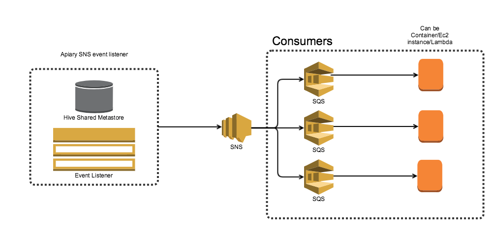

# Apiary Metastore Events

##  Overview
Apiary Metastore Events contains a set of modules responsible for retrieving and processing Hive Metastore events.

Currently, the following modules are defined:
 - [apiary-metastore-listener](apiary-metastore-listener) - listens to events from the Hive Metastore and publishes them to an SNS queue
 - [apiary-receivers](apiary-receivers) - provides an implementation for receiving and deserializing Hive events from a queue
 - [apiary-metastore-consumer](apiary-metastore-consumer) - provides implementation of features that are utilizing Hive Metastore events
  
The architecture below represents the flow of processing Hive Metastore events:

# Legal
This project is available under the [Apache 2.0 License](http://www.apache.org/licenses/LICENSE-2.0.html).

Copyright 2019 Expedia, Inc.
